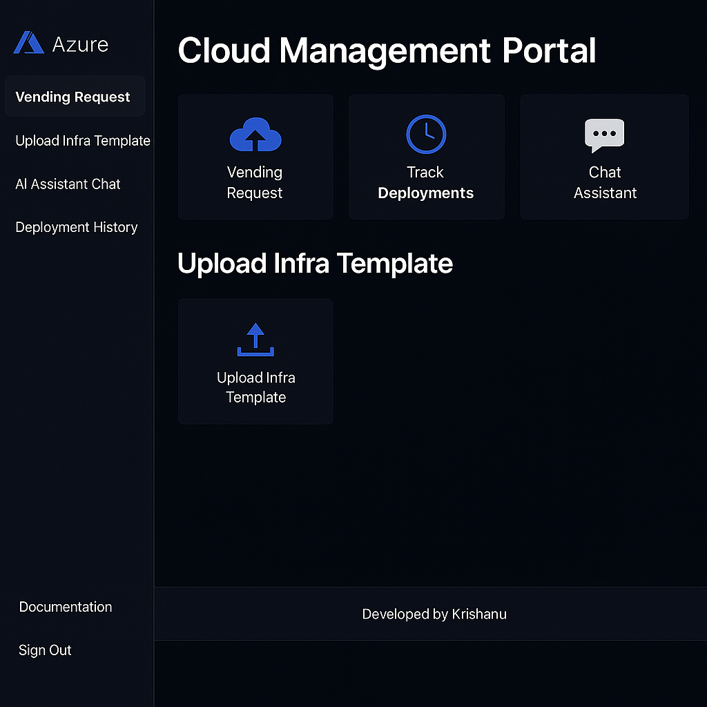

# Cloud Management Portal for Azure Subscription Vending

A full-stack AI-enhanced portal that enables self-service **Azure subscription vending**, automated **Terraform deployment**, **Datadog observability**, and integrated **Generative AI** for infrastructure insight and automation.

This architecture is modular and AI-native — scale at will.
Azure subscription vending via AVM Terraform modules  

---

## Key Features

- React + FastAPI portal with Azure AD authentication  
- Bitbucket Pipelines CI/CD with manual approvals  
- AI-generated `.tfvars`, README, validation, and drift summaries  
- Real-time Datadog RUM + APM observability  
- Azure Form Recognizer for `.tfvars` from scanned templates  
- AI-powered chatbot for infra assistance

---

## Architecture Overview

```
                ┌─────────────────────────────┐
                │        React Frontend       │
                │ (form + chat + preview UI)  │
                └────────────┬────────────────┘
                             │ REST API
                ┌────────────▼────────────┐
                │      FastAPI Backend    │
                │ - Azure OpenAI          │
                │ - Form Recognizer       │
                │ - tfvars/gen/validate   │
                └──────┬─────┬────────────┘
                       │     │
     ┌─────────────────┘     └────────────────────┐
     ▼                                              ▼
Terraform Plan & Apply                    Azure Form Recognizer
(Bitbucket Pipeline)                        (PDF, Tables, JSON)

```

---

## Directory Structure

```
cloud-mgmt-portal/
├── backend/
│   ├── main.py                     # FastAPI routes
│   ├── ai_utils.py                 # Azure OpenAI client
│   ├── form_recognizer.py          # Azure Form Recognizer logic
│   └── .env                        # API keys for AI
│
├── frontend/
│   ├── src/
│   │   ├── App.js
│   │   ├── TfvarsPreview.js        # View .tfvars from AI
│   │   ├── AssistantChat.js        # AI assistant component
│   │   └── UploadInfraTemplate.js  # Upload scanned infra
│
├── infra/
│   ├── main.tf                     # RG, Static Web, App Service
│   ├── keyvault.tf                 # Secrets mgmt
│   ├── datadog.tf                  # Datadog agent extension
│   ├── appinsights.tf             # Application Insights fallback
│   └── datadog_extension.tf       # Native integration
│
├── scripts/
│   └── import_dashboard.py        # Import dashboard to Datadog
│
├── docs/
│   └── postman-ai-api.json        # Postman collection
│
├── bitbucket-pipelines.yml        # Full CI/CD workflow
└── README.md                      # You're here
```

---

## CI/CD Flow (Bitbucket Cloud)

1. Terraform format check
2. Terraform plan output
3. Manual approval
4. Terraform apply
5. AI-generated summary posted to Teams

---

## Technologies Used

| Layer         | Stack                                 |
|---------------|----------------------------------------|
| Frontend      | React + Axios + MSAL                  |
| Backend       | FastAPI + Azure OpenAI + FormRecognizer |
| Infra-as-Code | Terraform (AVM PTN modules)           |
| CI/CD         | Bitbucket Pipelines                   |
| Observability | Datadog (APM, RUM, Logs)              |
| Cognitive AI  | Azure OpenAI, Azure Form Recognizer   |
| Auth          | Azure AD OAuth                        |

---

## Observability: Datadog Dashboard Example

- APM: backend latency & error rate
- RUM: frontend JS errors & page loads
- Logs: FastAPI structured JSON
- Alerts: Terraform errors, JS errors, API latency

---

## Generative AI Use Cases

- `.tfvars` suggestion from portal form inputs
- CSV generator for VNET/subnets/NSG
- Plan & drift summarizer post-Terraform
- AI README.md generation from state
- Chatbot assistant for engineers

---

## Setup & Deployment

```bash
# Deploy Infra
cd infra
terraform init
terraform apply

# Start Backend
cd backend
pip install -r requirements.txt
uvicorn main:app --reload

# Start Frontend
cd frontend
npm install
npm start
```

---

## Portal UX Pages

- Azure-branded navbar and footer (developed by Krishanu)
- Sidebar navigation (Vending, Upload, AI Chat, History)
- React pages powered by FastAPI AI endpoints

## UX Enhancements
- Dark mode toggle (Tailwind CSS)
- Flowbite integration for UI components


## Environment Variables for Terraform Backend
```
--- Terraform Backend Configuration (Optional) ---
backend "azurerm" {
   resource_group_name  = "rg-terraform-backend"
   storage_account_name = "tfstatebackendxyz"
   container_name       = "tfstate"
   key                  = "cloud-portal.terraform.tfstate"
 }
```

## Terraform Backend Configuration

```hcl
terraform {
  backend "azurerm" {
    resource_group_name  = "rg-terraform-backend"
    storage_account_name = "tfstatebackendxyz"
    container_name       = "tfstate"
    key                  = "cloud-portal.terraform.tfstate"
  }
}
```

## VNet Vending via CSV
- VNets are created dynamically from `infra/data/vnets.csv`
- AI summarizer reads decoded VNet definitions for plan insights

---

## CSV-Driven VNet Vending with AI Validation

This Cloud Management Portal supports vending Azure VNets using a declarative CSV format with built-in AI validation.

### How It Works
1. Upload your VNet definition CSV via the portal.
2. The backend FastAPI service:
   - Validates CIDR blocks
   - Flags duplicate names
   - Detects overlapping address spaces
3. The AI generates `.tfvars` preview for transparency and consistency.
4. Terraform reads from `csvdecode(file("vnets.csv"))` and dynamically creates resources.

---

### Sample VNet CSV

```csv
name,address_space,resource_group_name,location,env
vnet-app,10.0.0.0/16,rg-app,southeastasia,dev
vnet-infra,10.1.0.0/16,rg-infra,southeastasia,prod
```

---

### Bitbucket Pipeline Guardrails

The Bitbucket pipeline includes a pre-plan step that:
- Blocks deployment if any invalid CIDRs or duplicate VNet names exist
- Validates `infra/data/vnets.csv` using native Python logic

```yaml
- python <<EOF
import csv, ipaddress
# Validates CSV before terraform plan
EOF
```

---

### AI-Enhanced FastAPI Endpoint

```bash
POST /api/validate-vnets
```
- Input: VNet CSV
- Output:
  - Valid entries
  - Errors + warnings
  - `.tfvars` preview

---

### Frontend Component

`VNetCsvUploader.jsx`:
- Uploads `.csv` files
- Displays validation errors inline
- Shows `.tfvars` preview
- Built with Tailwind CSS


---

### Cloud Management Portal UI



- Includes VNet vending
- Upload infrastructure templates
- AI assistant and plan tracker
- Footer credit: Developed by Krishanu
- Links for Documentation and Sign Out added
